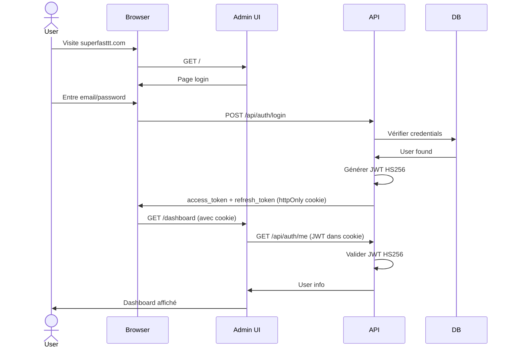
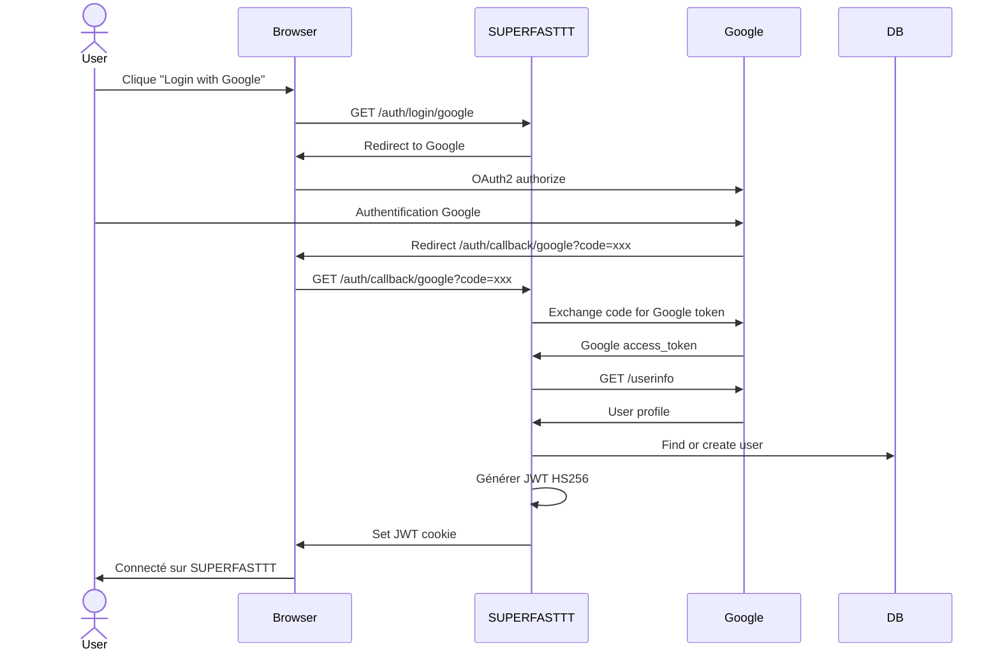
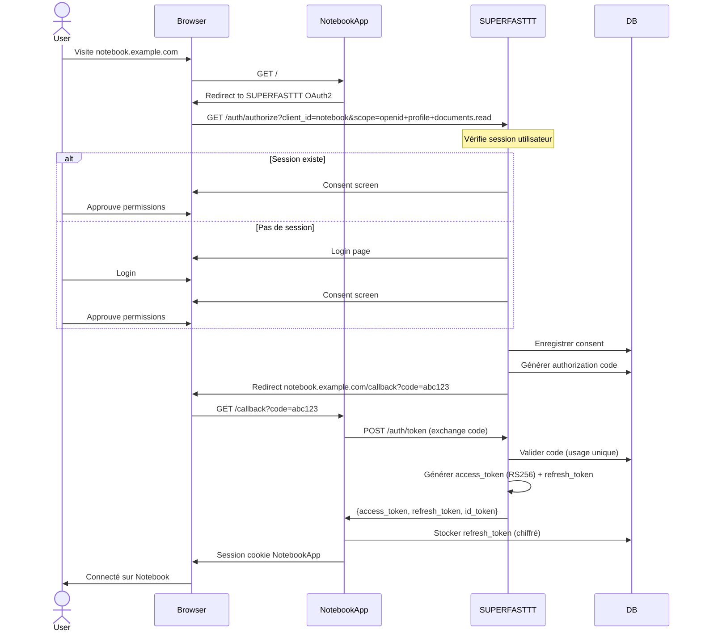
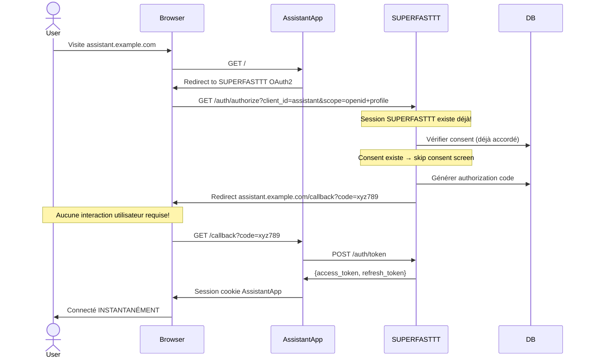
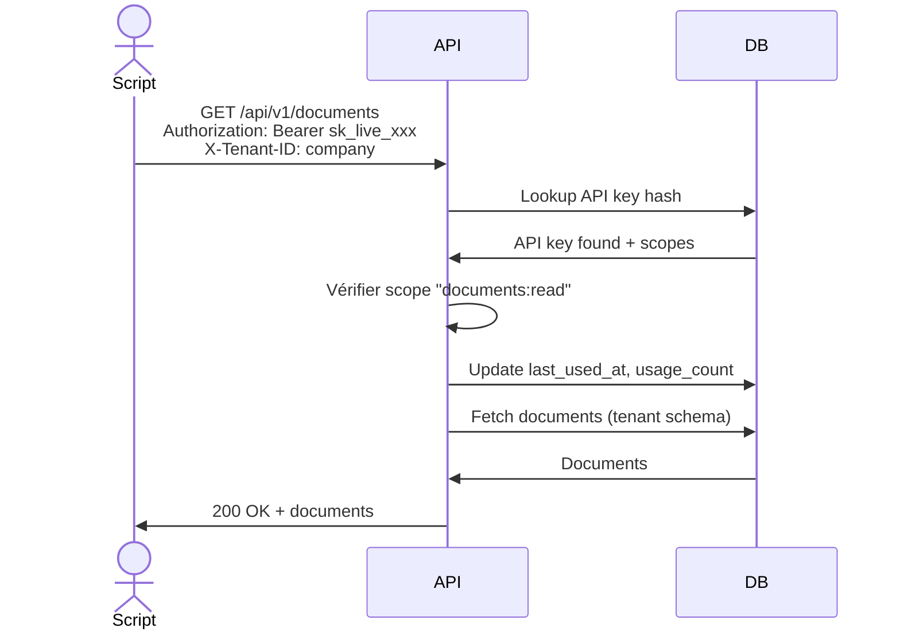

# Architecture d'Authentification et d'Autorisation SUPERFASTTT

> **Document maître** - Vue d'ensemble complète de tous les systèmes d'authentification et d'autorisation

---

## 📋 Table des matières

1. [Vue d'ensemble](#vue-densemble)
2. [Systèmes d'authentification](#systèmes-dauthentification)
3. [Cas d'usage par méthode](#cas-dusage-par-méthode)
4. [Architecture technique](#architecture-technique)
5. [Flux d'authentification](#flux-dauthentification)
6. [Mapping des permissions](#mapping-des-permissions)
7. [État d'implémentation](#état-dimplémentation)
8. [Documents de référence](#documents-de-référence)

---

## Vue d'ensemble

SUPERFASTTT utilise **quatre systèmes d'authentification complémentaires** pour couvrir différents cas d'usage :

```
┌─────────────────────────────────────────────────────────────────┐
│                     SUPERFASTTT Platform                         │
│                                                                  │
│  ┌──────────────┐  ┌──────────────┐  ┌──────────────┐          │
│  │   Admin UI   │  │  External    │  │  Integrations│          │
│  │  (Next.js)   │  │  Apps        │  │  (Services)  │          │
│  │              │  │  (Notebook,  │  │  (Google,    │          │
│  │              │  │   Assistant) │  │   Slack...)  │          │
│  └──────┬───────┘  └──────┬───────┘  └──────┬───────┘          │
│         │                 │                 │                   │
│         │ JWT HS256       │ OAuth2 RS256    │ OAuth2 Client    │
│         │ (Internal)      │ (Provider)      │ (Outbound)       │
│         │                 │                 │                   │
│  ┌──────▼─────────────────▼─────────────────▼───────────────┐  │
│  │            Authentication & Authorization Layer          │  │
│  │                                                           │  │
│  │  ┌─────────────┐  ┌──────────────┐  ┌────────────────┐  │  │
│  │  │ JWT Service │  │ OAuth2       │  │ SSO Providers  │  │  │
│  │  │ (HS256)     │  │ Provider     │  │ (Google/MS)    │  │  │
│  │  │             │  │ (RS256)      │  │                │  │  │
│  │  └─────────────┘  └──────────────┘  └────────────────┘  │  │
│  │                                                           │  │
│  │  ┌─────────────┐  ┌──────────────┐                       │  │
│  │  │ API Keys    │  │ RBAC         │                       │  │
│  │  │ Service     │  │ Permissions  │                       │  │
│  │  └─────────────┘  └──────────────┘                       │  │
│  └───────────────────────────────────────────────────────────┘  │
│                                                                  │
│  ┌───────────────────────────────────────────────────────────┐  │
│  │              Multi-Tenant Database Layer                  │  │
│  │  (PostgreSQL avec schema isolation)                       │  │
│  └───────────────────────────────────────────────────────────┘  │
└─────────────────────────────────────────────────────────────────┘

Utilisateurs externes
  │
  ├─ Entreprises → Google/Microsoft SSO → SUPERFASTTT → Apps tierces
  └─ Individuels → Email/Password → SUPERFASTTT → Apps tierces
```

---

## Systèmes d'authentification

### 1. JWT Interne (HS256) - Sessions utilisateurs

**📍 État : ✅ Implémenté**

**Usage :** Authentification des utilisateurs sur l'interface admin SUPERFASTTT

**Caractéristiques :**

- Algorithme : **HS256** (HMAC avec secret symétrique)
- Durée access token : 7 jours (configurable)
- Durée refresh token : 30 jours (configurable)
- Storage : **Stateless** (pas de stockage en base, validation cryptographique)
- Cookie : `httpOnly`, `secure`, `SameSite=Lax`

**Endpoints :**

- `POST /api/auth/login` - Connexion email/password
- `POST /api/auth/refresh` - Renouvellement token
- `GET /api/auth/me` - Infos utilisateur courant
- `GET /api/auth/verify` - Vérification token

**Payload JWT :**

```json
{
  "sub": "user-uuid",
  "email": "user@example.com",
  "tenant_id": "tenant-slug",
  "role": "TENANT_ADMIN",
  "type": "access",
  "exp": 1234567890,
  "iat": 1234567890
}
```

**Documentation :** [AUTHENTIFICATION.md](./AUTHENTIFICATION.md)

---

### 2. API Keys - Accès machine-to-machine

**📍 État : ✅ Implémenté**

**Usage :** Accès programmatique sans utilisateur humain (scripts, webhooks, CI/CD, services backend)

**Caractéristiques :**

- Format : `sk_live_xxxxxxxxxxxxx` ou `sk_test_xxxxxxxxxxxxx`
- Storage : Hash SHA256 en base de données
- Scopes : Permissions granulaires (ex: `documents:read`, `admin`)
- Révocation : Instantanée via API ou interface admin
- Expiration : Configurable ou aucune
- Audit : Logs complets (usage_count, last_used_at, ip_address)

**Utilisation :**

```bash
curl -H "Authorization: Bearer sk_live_xxxxx" \
     -H "X-Tenant-ID: company-slug" \
     https://api.superfasttt.com/api/v1/documents
```

**Cas d'usage :**

- Scripts de synchronisation de données
- Webhooks entrants
- Pipelines CI/CD
- Services backend sans utilisateur
- Intégrations système-to-système

**Documentation :** [API_KEYS_SYSTEM.md](./API_KEYS_SYSTEM.md)

---

### 3. OAuth2/OIDC Provider - Apps tierces avec SSO

**📍 État : ✅ Implémenté (Décembre 2025)** - voir [SSO_IMPLEMENTATION_ROADMAP.md](./SSO_IMPLEMENTATION_ROADMAP.md)

**Usage :** Single Sign-On pour applications tierces (knowledge-hub, admin, sf-project, sf-workflow)

**Caractéristiques :**

- Algorithme : **HS256** (HMAC) - RS256 prévu pour phase ultérieure
- Standard : OAuth 2.0 Authorization Code Flow avec PKCE
- Flow : Authorization Code avec PKCE (S256)
- Durée code : 60 secondes
- Storage : Codes stockés en base (usage unique)
- Clients pré-enregistrés : knowledge-hub, admin, sf-project, sf-workflow

**Endpoints implémentés :**

- ✅ `GET /auth/authorize` - Authorization endpoint
- ✅ `POST /auth/token` - Token exchange
- ✅ `GET /auth/silent-authorize` - Silent SSO check
- ✅ `GET /clients` - Liste des clients OAuth2 du tenant
- ⏳ `GET /.well-known/openid-configuration` - Discovery (à faire)
- ⏳ `GET /auth/jwks` - JSON Web Key Set (à faire avec RS256)

**Flow utilisateur :**

```
1. User visite notebook.example.com (première fois)
2. → Redirect vers superfasttt.com/auth/authorize
3. → User se connecte sur SUPERFASTTT (ou session existe déjà)
4. → Écran de consentement (si première app)
5. → Redirect vers notebook.example.com/callback?code=xxx
6. → Notebook échange code contre access_token + refresh_token
7. → User connecté sur Notebook

User visite assistant.example.com (même navigateur)
→ Session SUPERFASTTT existe → redirect immédiat → CONNECTÉ (sans re-login!)
```

**Scopes OAuth2 :**

- `openid` - Identité utilisateur
- `profile` - Nom, prénom, photo
- `email` - Adresse email
- `offline_access` - Refresh token
- `documents.read` - Lire documents
- `documents.write` - Créer/modifier documents
- `conversations.create` - Créer conversations
- `agents.read` - Lire agents
- `superfasttt.tenant` - Infos tenant

**Base de données (✅ créée) :**

- ✅ `oauth2_clients` - Apps externes enregistrées (knowledge-hub, admin, sf-project, sf-workflow)
- ✅ `oauth2_authorization_codes` - Codes temporaires (60 secondes, PKCE)
- ⏳ `refresh_tokens_oauth` - Tokens longue durée (à implémenter)
- ⏳ `user_consents` - Consentements utilisateur (à implémenter)

**Documentation :** [SSO_SUPERFASTTT.md](./SSO_SUPERFASTTT.md)

---

### 4. External SSO Providers - Login entreprise

**📍 État : 🔨 À implémenter**

**Usage :** Permettre aux entreprises de se connecter avec Google Workspace ou Microsoft 365

**Caractéristiques :**

- SUPERFASTTT agit comme **client OAuth2** auprès de Google/Microsoft
- Providers supportés : Google, Microsoft Azure AD, (GitHub future)
- Account linking : Associe compte SSO externe à compte SUPERFASTTT
- JIT Provisioning : Création automatique du compte à la première connexion
- Domain restriction : Restriction par domaine d'entreprise

**Flow utilisateur :**

```
1. User clique "Se connecter avec Google" sur SUPERFASTTT
2. → Redirect vers accounts.google.com
3. → User s'authentifie sur Google
4. → Google redirect vers SUPERFASTTT/auth/callback/google?code=xxx
5. → SUPERFASTTT échange code contre Google access token
6. → SUPERFASTTT récupère profil utilisateur Google
7. → SUPERFASTTT crée/lie compte utilisateur
8. → SUPERFASTTT crée session JWT (système 1)
9. → User connecté sur SUPERFASTTT
10. → User peut maintenant utiliser SSO SUPERFASTTT pour apps tierces (système 3)
```

**Configuration :**

```yaml
# Par tenant
sso_providers:
  - provider: google
    client_id: xxx.apps.googleusercontent.com
    client_secret: encrypted
    domain_restriction: example.com # Optionnel
    enabled: true

  - provider: microsoft
    client_id: xxx
    tenant_id: xxx # Azure AD tenant
    client_secret: encrypted
    enabled: true
```

**Base de données (à créer) :**

```sql
CREATE TABLE external_identity_providers (
  id UUID PRIMARY KEY,
  tenant_id VARCHAR(100) NOT NULL,
  provider VARCHAR(50) NOT NULL,  -- 'google', 'microsoft', 'github'
  client_id VARCHAR(255) NOT NULL,
  client_secret_encrypted TEXT NOT NULL,
  config JSONB,  -- domain_restriction, tenant_id Azure, etc.
  is_active BOOLEAN DEFAULT true,
  created_at TIMESTAMP DEFAULT NOW()
);

CREATE TABLE user_external_identities (
  id UUID PRIMARY KEY,
  user_id UUID NOT NULL REFERENCES users(id),
  provider VARCHAR(50) NOT NULL,
  external_user_id VARCHAR(255) NOT NULL,  -- Google sub, Microsoft oid
  external_email VARCHAR(255),
  metadata JSONB,
  linked_at TIMESTAMP DEFAULT NOW(),
  UNIQUE(provider, external_user_id)
);
```

**Documentation :** [AUTHENTIFICATION.md#sso-providers](./AUTHENTIFICATION.md#sso-providers)

---

## Cas d'usage par méthode

### Quand utiliser JWT Interne (HS256) ?

✅ **OUI - Utilisez JWT interne pour :**

- Interface admin SUPERFASTTT (Next.js)
- Sessions utilisateurs sur l'app principale
- API calls depuis l'interface web SUPERFASTTT
- Authentification first-party (même domaine)

❌ **NON - N'utilisez pas JWT interne pour :**

- Apps tierces sur domaines différents → Utilisez OAuth2
- Accès programmatique sans utilisateur → Utilisez API Keys
- Partage de sessions entre domaines → Utilisez OAuth2

---

### Quand utiliser API Keys ?

✅ **OUI - Utilisez API Keys pour :**

- Scripts automatisés
- Webhooks entrants
- Services backend sans utilisateur humain
- Pipelines CI/CD
- Intégrations système-to-système
- Accès long-terme sans re-authentification
- Environnements où OAuth2 est trop complexe

❌ **NON - N'utilisez pas API Keys pour :**

- Applications avec utilisateurs humains → Utilisez OAuth2
- Sessions web interactives → Utilisez JWT interne ou OAuth2
- Délégation de permissions utilisateur → Utilisez OAuth2

**Exemple :** Script de backup quotidien

```python
# Script s'exécute sans utilisateur, API Key parfaite
import requests

API_KEY = "sk_live_xxxxx"
headers = {
    "Authorization": f"Bearer {API_KEY}",
    "X-Tenant-ID": "company-slug"
}

response = requests.get(
    "https://api.superfasttt.com/api/v1/documents",
    headers=headers
)
```

---

### Quand utiliser OAuth2 Provider ?

✅ **OUI - Utilisez OAuth2 pour :**

- Applications tierces (Notebook IA, Assistant, Analytics)
- Single Sign-On entre applications
- Accès avec utilisateur humain
- Délégation de permissions (user autorise l'app)
- Révocation granulaire par utilisateur
- Applications sur domaines différents
- Applications mobiles/desktop avec PKCE

❌ **NON - N'utilisez pas OAuth2 pour :**

- Interface admin principale → Utilisez JWT interne
- Scripts automatisés → Utilisez API Keys
- Cas simples où JWT suffit

**Exemple :** Notebook IA

```typescript
// App tierce utilise OAuth2 pour SSO
import NextAuth from 'next-auth'

export default NextAuth({
  providers: [
    {
      id: 'superfasttt',
      type: 'oauth',
      wellKnown: 'https://superfasttt.com/.well-known/openid-configuration',
      clientId: 'notebook-app-client-id',
      clientSecret: 'secret',
      authorization: {
        params: {
          scope: 'openid profile email documents.read conversations.create',
        },
      },
    },
  ],
})

// User clique "Login" → redirect SUPERFASTTT → login UNE FOIS → accès permanent
```

---

### Quand utiliser External SSO Providers ?

✅ **OUI - Utilisez SSO externe pour :**

- Entreprises avec Google Workspace ou Microsoft 365
- Authentification centralisée IT
- Conformité et politiques de sécurité entreprise
- Provisioning automatique (JIT)
- Réduction de la gestion des mots de passe

❌ **NON - N'utilisez pas SSO externe pour :**

- Utilisateurs individuels sans compte entreprise (proposez aussi email/password)
- Applications programmatiques → API Keys

**Exemple :** Entreprise cliente

```
Employee @acme-corp.com se connecte :
1. Visite superfasttt.com
2. Clique "Se connecter avec Microsoft"
3. Authentifié par Azure AD Acme Corp
4. Compte créé automatiquement dans SUPERFASTTT tenant Acme Corp
5. Peut maintenant accéder aux apps tierces via SSO SUPERFASTTT
```

---

## Architecture technique

### Tokens et algorithmes

| Système             | Algorithme                         | Type de clé                   | Vérification                       | Révocation             |
| ------------------- | ---------------------------------- | ----------------------------- | ---------------------------------- | ---------------------- |
| JWT Interne         | **HS256**                          | Secret symétrique partagé     | Serveur uniquement (secret requis) | Impossible (stateless) |
| OAuth2 Access Token | **HS256** (actuel) / RS256 (futur) | Secret symétrique / Paire RSA | Serveur (HS256) ou client (RS256)  | Stateless              |
| OAuth2 Auth Code    | N/A (opaque)                       | UUID stocké en DB             | Lookup base de données             | Usage unique           |
| API Key             | N/A (opaque)                       | Hash SHA256 en DB             | Lookup base de données             | Immédiate (flag DB)    |

### Pourquoi deux algorithmes JWT différents ?

**HS256 pour JWT interne :**

- ✅ Plus simple : une seule clé secrète
- ✅ Plus rapide : HMAC vs RSA
- ✅ Suffisant : vérification serveur-side uniquement
- ✅ Pas besoin d'exposer clés publiques

**RS256 pour OAuth2 :**

- ✅ Standard OIDC requis
- ✅ Clé publique exposée via `/auth/jwks`
- ✅ Apps tierces peuvent vérifier tokens localement
- ✅ Rotation de clés sans partager secret
- ✅ Conformité avec bibliothèques OAuth2 standard

**Les deux coexistent harmonieusement :**

```python
# JWT interne (HS256)
internal_token = jwt.encode(
    payload,
    settings.JWT_SECRET,
    algorithm="HS256"
)

# OAuth2 access token (RS256)
oauth_token = jwt.encode(
    payload,
    rsa_private_key,
    algorithm="RS256",
    headers={"kid": "superfasttt-2024"}
)
```

---

### Mapping des scopes et permissions

**Problème :** OAuth2 utilise des scopes simples (`documents.read`), RBAC utilise des permissions hiérarchiques (`documents.read.own`)

**Solution :** Mapping dynamique basé sur le rôle utilisateur

```python
def map_oauth_scope_to_rbac_permissions(
    scope: str,
    user_role: str
) -> list[str]:
    """
    Convertit un scope OAuth2 en permissions RBAC selon le rôle.

    Exemple:
      scope='documents.read', role='USER' → ['documents.read.own']
      scope='documents.read', role='ADMIN' → ['documents.read.all']
    """

    mapping = {
        "documents.read": {
            "VIEWER": ["documents.read.shared"],
            "USER": ["documents.read.own", "documents.read.shared"],
            "MANAGER": ["documents.read.team"],
            "TENANT_ADMIN": ["documents.read.all"],
            "SUPER_ADMIN": ["documents.read.all"]
        },
        "documents.write": {
            "USER": ["documents.write.own"],
            "MANAGER": ["documents.write.team"],
            "TENANT_ADMIN": ["documents.write.all"],
            "SUPER_ADMIN": ["documents.write.all"]
        },
        "admin": {
            "TENANT_ADMIN": ["*.*.*"],  # Toutes permissions tenant
            "SUPER_ADMIN": ["*.*.*"]
        }
    }

    return mapping.get(scope, {}).get(user_role, [])


# Validation d'un access token OAuth2
async def validate_oauth_access_token(token: str, required_scope: str):
    # 1. Vérifier signature RS256
    payload = jwt.decode(token, rsa_public_key, algorithms=["RS256"])

    # 2. Récupérer user
    user = await get_user(payload["sub"])

    # 3. Vérifier scope présent dans token
    if required_scope not in payload.get("scopes", []):
        raise HTTPException(403, "insufficient_scope")

    # 4. Mapper scope → permissions RBAC
    permissions = map_oauth_scope_to_rbac_permissions(
        required_scope,
        user.role
    )

    # 5. Vérifier permission effective
    if not await user_has_permission(user.id, permissions):
        raise HTTPException(403, "insufficient_permissions")

    return user
```

**Exemple concret :**

```
App tierce demande scope: "documents.read"

User A (role=USER):
  → Scope accepté → Permission RBAC = "documents.read.own"
  → Peut lire UNIQUEMENT ses propres documents

User B (role=TENANT_ADMIN):
  → Scope accepté → Permission RBAC = "documents.read.all"
  → Peut lire TOUS les documents du tenant
```

---

## Flux d'authentification

### Flux 1 : User se connecte sur Admin SUPERFASTTT



---

### Flux 2 : User se connecte via Google SSO



---

### Flux 3 : User accède à app tierce via OAuth2 SSO (première fois)



---

### Flux 4 : User accède à 2ème app tierce (SSO transparent)



**✨ Magie du SSO :** User connecté sur Assistant sans re-saisir password !

---

### Flux 5 : Script utilise API Key



---

## État d'implémentation

### ✅ Implémenté (Production Ready)

| Composant                   | Fichiers                                       | Tests |
| --------------------------- | ---------------------------------------------- | ----- |
| **JWT HS256 Service**       | `apps/api/app/core/auth/jwt.py`                | ✅    |
| **Auth Endpoints**          | `apps/api/app/routes/auth/login.py`            | ✅    |
| **API Keys Models**         | `apps/api/app/models/api_key.py`               | ✅    |
| **API Keys Service**        | `apps/api/app/core/security/auth_service.py`   | ✅    |
| **RBAC Permissions**        | `apps/api/app/core/rbac/permissions.py`        | ✅    |
| **Multi-tenant DB**         | `apps/api/app/core/database.py`                | ✅    |
| **Audit Logs**              | `apps/api/app/models/audit_log.py`             | ✅    |
| **Dependencies**            | `apps/api/app/core/auth/dependencies.py`       | ✅    |
| **OAuth2 Provider (HS256)** | `apps/api/app/routes/auth/oauth2.py`           | ✅    |
| **OAuth2 Admin API**        | `apps/api/app/routes/admin/oauth_clients.py`   | ✅    |
| **OAuth2 Tables**           | `oauth2_clients`, `oauth2_authorization_codes` | ✅    |

### ⏳ En cours / À implémenter

| Composant                  | Priorité      | Statut      | Roadmap                                         |
| -------------------------- | ------------- | ----------- | ----------------------------------------------- |
| **RS256 JWT Service**      | P0 - Critical | ⏳ En cours | Phase 2                                         |
| **OIDC Discovery**         | P1 - High     | ⏳ À faire  | `.well-known/openid-configuration`              |
| **JWKS Endpoint**          | P1 - High     | ⏳ À faire  | `/auth/jwks`                                    |
| **External SSO Providers** | P1 - High     | 📝 Planifié | [Voir roadmap](./SSO_IMPLEMENTATION_ROADMAP.md) |
| **Consent Screen UI**      | P2 - Medium   | 📝 Planifié | Phase 4                                         |
| **OAuth2 Admin UI**        | P1 - High     | 2 semaines  | Phase 4                                         |
| **User Consent UI**        | P1 - High     | 1 semaine   | Phase 3                                         |

**Voir roadmap détaillée :** [SSO_IMPLEMENTATION_ROADMAP.md](./SSO_IMPLEMENTATION_ROADMAP.md)

---

## Documents de référence

### Documentation par système

| Système                | Document principal                                             | Fichiers code                         |
| ---------------------- | -------------------------------------------------------------- | ------------------------------------- |
| **JWT Interne**        | [AUTHENTIFICATION.md](./AUTHENTIFICATION.md)                   | `apps/api/app/core/auth/`             |
| **API Keys**           | [API_KEYS_SYSTEM.md](./API_KEYS_SYSTEM.md)                     | `apps/api/app/core/security/`         |
| **OAuth2 Provider**    | [SSO_SUPERFASTTT.md](./SSO_SUPERFASTTT.md)                     | À créer                               |
| **External SSO**       | [AUTHENTIFICATION.md#sso](./AUTHENTIFICATION.md)               | À créer                               |
| **Intégrations OAuth** | [INTEGRATIONS_OAUTH_CLIENT.md](./INTEGRATIONS_OAUTH_CLIENT.md) | `apps/api/app/services/integrations/` |
| **Permissions RBAC**   | [MODULE_PERMISSIONS.md](./MODULE_PERMISSIONS.md)               | `apps/api/app/core/rbac/`             |

### Guides et références

- **[AUTH_TERMINOLOGY.md](./AUTH_TERMINOLOGY.md)** - Glossaire complet
- **[SSO_IMPLEMENTATION_ROADMAP.md](./SSO_IMPLEMENTATION_ROADMAP.md)** - Planning d'implémentation
- **[DEVELOPER_GUIDE.md](./DEVELOPER_GUIDE.md)** - Guide développeur avec exemples
- **[DEPLOYMENT.md](./DEPLOYMENT.md)** - Configuration production

### Choix de la méthode d'authentification

```
┌─────────────────────────────────────────────────────────────────┐
│                  Quelle méthode utiliser ?                       │
└─────────────────────────────────────────────────────────────────┘

L'utilisateur est-il humain ?
  │
  ├─ NON (script, service, webhook)
  │   └─> API KEYS
  │
  └─ OUI
      │
      ├─ Accède à l'admin SUPERFASTTT ?
      │   └─> JWT INTERNE (HS256)
      │
      ├─ Accède à une app tierce ?
      │   └─> OAuth2 PROVIDER (RS256)
      │
      └─ Entreprise avec Google/Microsoft ?
          └─> EXTERNAL SSO → puis JWT interne ou OAuth2
```

### Matrice de décision

| Critère                    | JWT Interne | API Keys  | OAuth2 Provider | External SSO |
| -------------------------- | ----------- | --------- | --------------- | ------------ |
| **Utilisateur humain**     | ✅          | ❌        | ✅              | ✅           |
| **Accès programmatique**   | ❌          | ✅        | ❌              | ❌           |
| **Multi-domaines**         | ❌          | ✅        | ✅              | N/A          |
| **Délégation permissions** | ❌          | ❌        | ✅              | N/A          |
| **Révocation granulaire**  | ❌          | ✅        | ✅              | N/A          |
| **Durée session**          | 7 jours     | Illimitée | 1h + refresh    | N/A          |
| **Standards**              | Custom      | Custom    | OAuth2/OIDC     | OAuth2/OIDC  |
| **Complexité**             | Faible      | Faible    | Élevée          | Moyenne      |

---

## Sécurité

### Bonnes pratiques

**JWT Interne :**

- ✅ Secret fort (32+ caractères aléatoires)
- ✅ Cookies `httpOnly`, `secure`, `SameSite=Lax`
- ✅ Expiration courte (7 jours max)
- ✅ Rotation du secret régulière

**API Keys :**

- ✅ Hash SHA256 (jamais stocker en clair)
- ✅ Préfixe visible (`sk_live_`) pour identification
- ✅ Scopes minimaux (principe du moindre privilège)
- ✅ Expiration automatique
- ✅ Audit complet (last_used, usage_count)
- ✅ Rate limiting par clé

**OAuth2 Provider :**

- ✅ PKCE obligatoire pour apps publiques
- ✅ Redirect URI strict whitelist
- ✅ Authorization codes usage unique
- ✅ State parameter pour CSRF protection
- ✅ RS256 avec rotation de clés
- ✅ Refresh token rotation optionnelle

**External SSO :**

- ✅ Validation du state parameter
- ✅ Vérification du domaine email si domain restriction
- ✅ Encryption des client secrets
- ✅ Audit trail complet

### Rate Limiting

| Endpoint                    | Limite        | Fenêtre           |
| --------------------------- | ------------- | ----------------- |
| `POST /api/auth/login`      | 5 tentatives  | 15 minutes par IP |
| `POST /api/auth/refresh`    | 20 requêtes   | 1 minute          |
| `POST /auth/token` (OAuth2) | 10 requêtes   | 1 minute          |
| API Keys                    | 1000 requêtes | 1 heure par clé   |

---

## Support et contribution

**Questions :** Consultez d'abord [AUTH_TERMINOLOGY.md](./AUTH_TERMINOLOGY.md)

**Issues :** Reportez les problèmes sur GitHub avec le label `authentication`

**Contributions :** Voir [CONTRIBUTING.md](../CONTRIBUTING.md)

---

**Dernière mise à jour :** 2025-01-22
**Auteurs :** Équipe SUPERFASTTT Core
